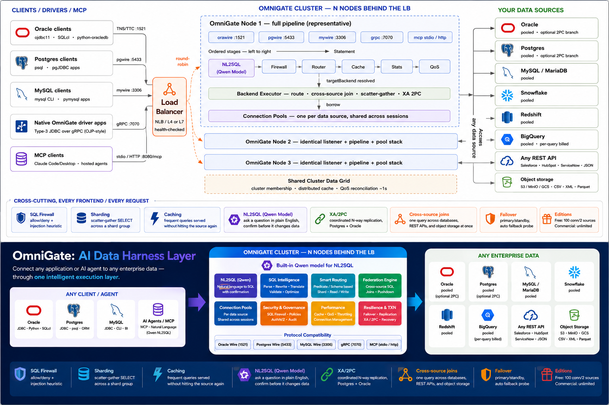
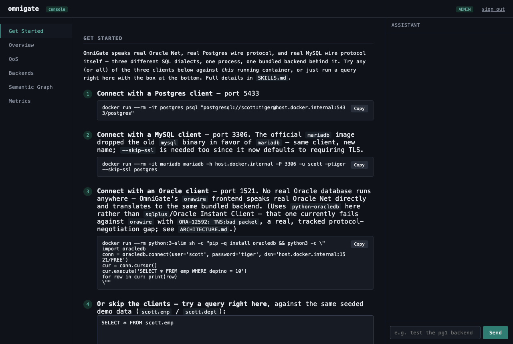

# OmniGate — Free Edition

**Connect your existing Oracle, Postgres, or MySQL tools to any database — no driver changes, no app rewrites. Ask it questions in plain English. Govern who sees what.**

OmniGate sits in front of your database(s) and speaks Oracle, Postgres, and MySQL wire protocol all at once. Point whatever client, ORM, or BI tool you already use at OmniGate instead of your database directly, and it just works — even if your actual database is a completely different kind. On top of that gateway sits a full natural-language analytics layer: NL2SQL, a self-governing data ontology, row/column access control, and a real admin console to run all of it.



Five different ways in — Oracle clients, Postgres clients, MySQL clients, apps using OmniGate's
own native driver, and AI agents over MCP — all land on the same cluster and can reach any of
your connected data sources, including ones that aren't traditional databases at all: REST APIs,
SaaS platforms, and files sitting in S3-compatible object storage. Nobody has to change their tools.

## Contents

- [Why](#why)
- [Get started in under a minute](#get-started-in-under-a-minute)
- [The admin console](#the-admin-console)
- [Data sources](#data-sources)
- [Groups — organizing backends, users, and models](#groups--organizing-backends-users-and-models)
- [Natural-language questions (NL2SQL)](#natural-language-questions-nl2sql)
- [Config storage](#config-storage)
- [Authentication](#authentication)
- [Configuration reference](#configuration-reference)
- [This is the free edition](#this-is-the-free-edition)

## Why

- **Use the client you already have.** Oracle scripts, Postgres ORMs, MySQL BI dashboards, or an AI agent talking MCP — all keep working unchanged.
- **Any data source, one gateway.** Postgres, MySQL/MariaDB, Oracle, SQL Server, Snowflake, Redshift, BigQuery, Databricks, Aurora — plus S3/S3-compatible/Azure Blob object storage, and REST-based SaaS sources (Salesforce, HubSpot, ServiceNow, GitHub, Microsoft Graph/SharePoint, and any other API). Connect what you have, add more later, live, no restart.
- **Join across all of them, in one query.** Combine rows from a database with a CSV file in object storage, or with a REST API, in a single SQL statement — not a separate export/import step.
- **Ask it questions in plain English.** NL2SQL turns a typed-out question into SQL and runs it, with local models (Qwen/Gemma) supported out of the box — no API key required — and a confirmation step before anything that changes data.
- **Organize backends and users into groups.** Everyone's default is "All groups" (every backend they can reach); an admin can scope specific users to specific backends and give a group its own NL2SQL model, no code, all from the console.
- **Faster on the second ask.** Frequently-run queries are cached automatically, and pre-aggregated rollups transparently accelerate matching aggregate queries.
- **A real admin console**, not a stub — data sources, groups, LLM settings, NL2SQL accuracy insights, a reviewable ontology queue, rollups, metrics, a question bank, and a full audit log.
- **Nothing to install for your team.** OmniGate is the only new thing; everyone's existing tools connect exactly as they normally would.
- **Built to grow with you.** Run one instance for a small setup, or a load-balanced cluster with automatic failover for production — same product either way.

## Get started in under a minute

```bash
git clone https://github.com/kumarrajamani-ai/omnigate-free.git
cd omnigate-free
docker compose up
```

Then open **http://localhost:8080/console** — the real, live console this starts:



Full client walkthrough (all three protocol snippets, plus the query box): **[SKILLS.md](SKILLS.md)**.

The full admin console — Data Sources, Groups, LLM Settings, NL2SQL Insights, Ontology, Rollups, Metrics, Question Bank, Audit Log — lives at **http://localhost:8080/admin** (see below; open with no `OMNIGATE_AUTH_*` set and it's unauthenticated, fine for local trial, not for anything exposed beyond `localhost`).

## The admin console

Everything below is a real, working page in this image — not a mockup. Each one edits live
config, applied immediately, no restart, persisted so it survives a container restart (see
[Config storage](#config-storage)).

| Page | What it does |
|---|---|
| **Data sources** | Add/edit backends. A type dropdown (Postgres, Oracle, MySQL, SQL Server, Snowflake, Redshift, BigQuery, Databricks, Aurora, S3, S3-compatible, Azure Blob, Salesforce, HubSpot, ServiceNow, YouTube, GitHub, Microsoft Graph/SharePoint, generic REST/JDBC) fills in a real sample connection string per source. "Discover schemas" tests a connection live before you save it. |
| **Groups** | Organize backends and users into groups. Every user's default is "All groups"; adding someone to a group gives them an extra, narrower option. Add/remove business-app users from a group with a checkbox picker, or create a new group inline right from the Data Sources page. |
| **LLM Settings** | Which model answers NL2SQL questions — a global default, plus an optional override per group. Point "Local" mode at an already-running `llama-server`; saving applies immediately. |
| **NL2SQL insights** | Real accuracy/reliability data — a live query log, category accuracy breakdown, judge-correction activity, and a one-click benchmark run, scoped to the global model or a specific group. |
| **Ontology review** | Every suggestion the semantic layer raises (implicit joins, possible duplicate entities, PII column grants) lands in a reviewable queue — nothing auto-applies to production unless explicitly configured to. |
| **Rollups** | Pre-aggregated tables that transparently speed up matching aggregate queries — define one, see whether it's actually being used. |
| **Metrics** | Named business terms mapped to real SQL expressions, usable by name in any question. |
| **Question bank** | The living, admin-approved library real questions are matched against first, before the LLM generates fresh SQL — generate drafts, import from real SQL history, or add manually. |
| **Audit log** | Who accessed what, when — every access decision and admin action, most recent first. |

## Data sources

Point the **Data sources** page's type dropdown at whatever you're connecting, and it fills in a
real, working sample connection string to start from:

- **Relational (JDBC):** PostgreSQL, MySQL/MariaDB, Oracle, SQL Server, Snowflake, Redshift,
  BigQuery, Databricks, Amazon Aurora (Postgres- and MySQL-compatible)
- **Object storage:** Amazon S3, S3-compatible (MinIO, Wasabi, OCI, GCS interop), Azure Blob
  Storage — CSV/XML/Parquet files queried as SQL tables
- **REST/SaaS** (via a generic, source-agnostic REST adapter, not a per-vendor connector):
  Salesforce, HubSpot, ServiceNow, YouTube Data API, GitHub, Microsoft Graph/SharePoint, or any
  other paginated, authenticated REST API

"Discover schemas" runs a real connection test before you ever hit Save. Assign the new source to
a group right there — pick an existing one, or type a new name and it's created for you.

## Groups — organizing backends, users, and models

A group is a named collection of backends, plus (optionally) a roster of business-app users
granted into it, plus its own NL2SQL model override. Every user's default is **All groups** —
unrestricted, exactly the pre-groups behavior — so groups are additive: adding someone to
"Sales" just gives them one more, narrower option to pick from when they ask a question, it never
takes "All groups" away.

In the Ask app (the business-user "ask a question" UI, at `/`), a dropdown in the top-right corner
lets a user switch between "All groups" and whichever named group(s) they belong to — no forced
picker screen between logging in and asking a question.

## Natural-language questions (NL2SQL)

Type a question in plain English in the Ask app and OmniGate translates it to real SQL, runs it
through the same access-control pipeline every other query goes through, and — optionally — has a
second "judge" model review the generated SQL before it executes. Local models (no API key, no
data leaves the machine) are supported out of the box; point **LLM Settings** at an
already-running `llama-server` and save — it applies to the very next question, no restart. A
hosted model (Anthropic, or anything OpenAI-compatible) works the same way, just with an API key
instead of a local port.

## Config storage

Everything edited in the admin console — data sources, groups, LLM settings, rollups, metrics,
access policy — persists to a real database, not just in-memory:

- **By default**, a file-backed **embedded HSQLDB** instance under `OMNIGATE_DATA_DIR` — zero
  external database to stand up. Mount a volume there and config survives a container restart.
- **For a larger deployment**, set `OMNIGATE_CONFIG_DB` to point at an external Postgres (or any
  JDBC-reachable) database instead — same format as every other backend spec in this project:
  `jdbc:postgresql://host:5432/db|user|password`.

Every persisted key is also readable through a single API — `GET /api/config` (everything,
credential-shaped values redacted) or `GET /api/config/value?key=...` (one key) — for scripting
or an external inventory tool, gated by the same auth as everything else below.

## Authentication

The admin console and its API are **unauthenticated by default** (fine for a local trial, not for
anything reachable beyond `localhost`). Turn on any combination of:

- **Local username/password** — `OMNIGATE_AUTH_USERS`, one or more accounts with a role
  (`admin`/`reader`). Generate a password hash with `java -cp omnigate.jar com.omnigate.http.auth.PasswordHash <password>`.
- **Static bearer tokens** — `OMNIGATE_AUTH_API_TOKENS`, for scripted/Prometheus access with no
  session/cookie needed.
- **Enterprise SSO** — `OMNIGATE_AUTH_OIDC_*`, any standard OIDC provider: Okta, Entra ID (Azure
  AD), Auth0, Google Workspace, Keycloak. Real discovery + ID-token verification against the
  provider's own JWKS, not a stub.
- **AWS IAM** — `OMNIGATE_AUTH_AWS_IAM_ADMIN_ARNS`/`_READER_ARNS`. A caller signs a real
  `sts:GetCallerIdentity` request with their own AWS credentials (SigV4, via the AWS SDK);
  OmniGate verifies it by replaying that exact request to AWS's own STS endpoint — the same
  pattern HashiCorp Vault's and Teleport's AWS auth methods use, since only AWS can actually check
  a SigV4 signature against a caller's real secret key.

All four can be enabled at once. See the main repo's `ARCHITECTURE.md` for the full design notes
on each (search for "AWS IAM", "OIDC", or "ConfigStore").

## Configuration reference

The full, current list of every environment variable lives in the main repo's `ARCHITECTURE.md`
(searchable by feature name — each is introduced alongside the section that added it). The most
commonly needed, for this image:

| Variable | What it's for |
|---|---|
| `ORAPG_PG_HOST`/`_PORT`/`_DATABASE`/`_USER`/`_PASSWORD` | The bundled/seeded Postgres backend this compose file starts |
| `OMNIGATE_CONFIG_DB` | Point config storage at an external Postgres instead of the embedded default |
| `OMNIGATE_DATA_DIR` | Where the embedded config database's files live (default `./omnigate-data`, `/var/lib/omnigate/data` in this image) |
| `OMNIGATE_AUTH_USERS` / `_API_TOKENS` / `_OIDC_*` / `_AWS_IAM_*_ARNS` | Admin console authentication (see above) |
| `OMNIGATE_APP_USERS` | Business-user accounts for the Ask app |
| `OMNIGATE_ASSISTANT_LLAMA_SERVER_PATH` / `_MODEL_PATH` | Local NL2SQL model (see [SKILLS.md](SKILLS.md) §4) |
| `OMNIGATE_NL2SQL_JUDGE_LLAMA_SERVER_PATH` / `_MODEL_PATH` | Optional second "judge" model that reviews generated SQL |

## This is the free edition

Free to use, no signup, no time limit — capped at 100 concurrent connections and 2 connected
databases. Every feature above (groups, NL2SQL, the full admin console, all authentication
options, config storage) is the same code as the commercial edition — only scale is capped,
nothing is feature-gated. Need more? The commercial edition removes both caps — **contact the
repo owner ([@kumarrajamani-ai](https://github.com/kumarrajamani-ai)) to get access.**
