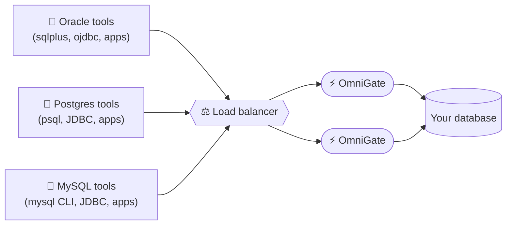

# OmniGate — Free Edition

**Connect your existing Oracle, Postgres, or MySQL tools to any database — no driver changes, no app rewrites.**

OmniGate sits in front of your database and speaks Oracle, Postgres, and MySQL all at once. Point whatever client, ORM, or BI tool you already use at OmniGate instead of your database directly, and it just works — even if your actual database is a completely different kind.



Three different clients, three different SQL dialects, one database behind it. Nobody has to
change their tools. The load balancer is only needed if you run more than one OmniGate instance
for redundancy or scale — a single instance works just as well for smaller setups (that's exactly
what `docker compose up` below gives you).

## Why

- **Use the client you already have.** Your team's existing Oracle scripts, Postgres ORMs, or MySQL BI dashboards keep working, unchanged.
- **One gateway, any backend.** Swap or add backends behind OmniGate without touching a single client connection string.
- **A built-in web console.** See what's connected, run a query, and — with the optional local AI assistant — get help fixing a broken query, right in your browser.
- **Nothing to install for your team.** OmniGate is the only new thing; everyone's existing tools connect exactly as they normally would.

## Get started in under a minute

```bash
git clone https://github.com/kumarrajamani-ai/omnigate-free.git
cd omnigate-free
docker compose up
```

Then open **http://localhost:8080/console** — it walks you through trying it with your own client, or a query box right in the browser. Full walkthrough: **[SKILLS.md](SKILLS.md)**.

## This is the free edition

Free to use, no signup, no time limit — capped at 100 concurrent connections and 2 connected
databases. Need more? The commercial edition removes both caps; see
**[the main OmniGate project](https://github.com/kumarrajamani-ai/Omnigate)** for details, full
documentation, and the source code.
